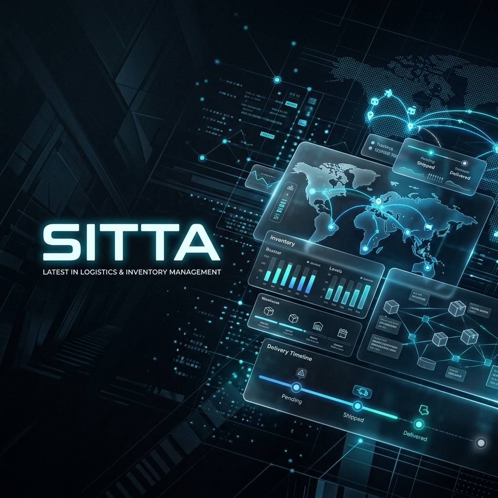

<p align="center">
  
</p>

<h1 align="center">🚀 SITTA (Vanilla JS Edition)</h1>

<p align="center">
  <strong>Sistem Informasi Transaksi & Tracking Bahan Ajar</strong><br>
  <em>Premium Inventory & Logistics Management System for Universitas Terbuka</em>
</p>

<p align="center">
  
  
  
  
</p>

---

## 📋 Deskripsi Proyek

**SITTA** adalah aplikasi web modern berbasis *Client-Side* yang dirancang untuk mengelola inventaris, transaksi, dan pelacakan pengiriman bahan ajar di Universitas Terbuka. Aplikasi ini mengusung tema **Cinematic Dark Mode** yang premium dengan fokus pada UI/UX yang intuitif dan fungsionalitas realtime menggunakan teknologi web murni.

---

## 🚀 Fitur Utama

1.  **Dashboard Interaktif**: Ringkasan operasional dengan widget statistik (Stok Total, DO Selesai, Stok Limit) dan grafik progres aktivitas.
2.  **Manajemen Stok (Realtime)**:
    *   Tampilan Grid & Tabel (View Toggle).
    *   Filter pencarian cerdas dan kategori barang (BMP/Non-BMP).
    *   Sistem manajemen stok melalui modal interaktif.
3.  **Sistem Keranjang & Checkout**:
    *   *Floating Cart Button* dengan badge reaktif.
    *   Manajemen kuantitas produk langsung di keranjang.
    *   Pengurangan stok otomatis terintegrasi dengan storage.
4.  **Struk Digital Otomatis**: Generate *Official Receipt* instan dengan No. Billing dan No. Resi unik.
5.  **Tracking Pengiriman**: Simulasi pelacakan status pengiriman *live* dengan rincian timeline perjalanan paket.
6.  **Laporan & Histori**:
    *   Export data transaksi ke format **CSV** untuk kebutuhan laporan.
    *   Filter riwayat berdasarkan status dan rentang waktu.

---

## 🛠️ Teknologi yang Digunakan

| Komponen | Teknologi | Detail Implementasi |
| :--- | :--- | :--- |
| **Structure** | HTML5 | Semantik Modern |
| **Styling** | Vanilla CSS3 | Glassmorphism, CSS Variables, Flex/Grid Layout |
| **Logic** | JavaScript (ES6+) | DOM Manipulation, Event Listeners |
| **Persistence** | LocalStorage | Data Store (Stok, Histori, Cart) |
| **Icons** | FontAwesome 6 | Professional UI Iconography |
| **Typography** | Inter | Google Fonts Integration |

---

## 📂 Struktur File

```text
Pemrograman_berbasis_web/
├── css/
│   └── style.css       # Core Design System (Cinematic Theme)
├── js/
│   ├── data.js         # Initial State & Mock Database
│   └── script.js       # Core Logic (Transactions, Cart, UI)
├── index.html          # Authentication Gateway
├── dashboard.html      # Analytics & Overview
├── stok.html           # Inventory & Shopping Module
├── tracking.html       # Logistics Tracking System
└── histori.html        # Transaction Reports
```

---

## ⚙️ Logika Sistem (Core Logic)

*   **Autentikasi**: Memanfaatkan `sessionStorage` untuk menjaga keamanan sesi pengguna antar halaman.
*   **Data Persistence**: Sinkronisasi array `stockStore` dan `historyStore` ke `localStorage` untuk memastikan data tidak hilang saat browser dimuat ulang.
*   **Realtime UI Rendering**: Setiap interaksi (seperti checkout) memicu fungsi re-render komponen UI sehingga data terlihat sinkron seketika.
*   **Dynamic Tracking**: Algoritma penghitungan waktu untuk mensimulasikan status perjalanan paket berdasarkan ID transaksi.

---

## 📤 Instruksi Deployment

1.  **Repository Setup**: `git init` dan hubungkan ke remote origin.
2.  **Commit Data**: `git add .` dan `git commit -m "Build: Release SITTA App"`.
3.  **Push to Cloud**: `git push -u origin main`.
4.  **GitHub Pages**: Aktifkan di menu Settings > Pages untuk hosting gratis.

---

## ⚡ Full-Stack Implementation (Node.js + Express)

Aplikasi ini sekarang mendukung **Full-Stack Architecture**. Data tidak lagi disimpan di `localStorage` browser, melainkan di database server (JSON-based LowDB) melalui REST API.

### 🛠️ Backend Tech Stack
*   **Runtime**: Node.js
*   **Framework**: Express.js
*   **Database**: LowDB (JSON File Database)
*   **Auth**: JSON Web Token (JWT)

### 🚀 Cara Menjalankan (Local)
1.  **Masuk ke folder backend**:
    ```bash
    cd backend
    ```
2.  **Install dependensi** (jika pertama kali):
    ```bash
    npm install
    ```
3.  **Jalankan server**:
    ```bash
    node server.js
    ```
4.  **Akses Aplikasi**:
    Buka [http://localhost:3000](http://localhost:3000) di browser Anda.

> [!IMPORTANT]
> Pastikan backend berjalan di terminal agar fitur Login, Stok, dan Tracking dapat berfungsi dengan data dari database.

---

## 👨‍💻 Author

| Detail | Information |
| :--- | :--- |
| **Nama** | [Isi Nama Anda] |
| **NIM** | [Isi NIM Anda] |
| **UPBJJ** | Universitas Terbuka |
| **Mata Kuliah** | Pemrograman Berbasis Web |

---

<p align="center">
  <i>"Menuju Digitalisasi Pendidikan Tinggi Terbuka dan Jarak Jauh."</i><br>
  <strong>© 2026 Universitas Terbuka - Developed by [dems123tech](https://github.com/dems123tech)</strong>
</p>

